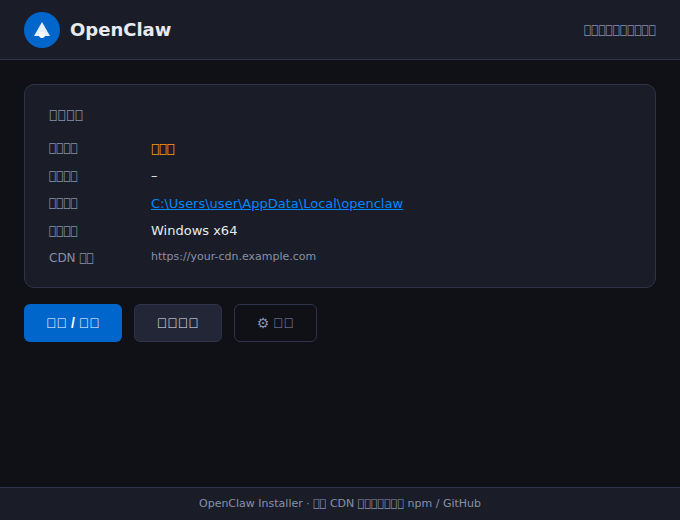
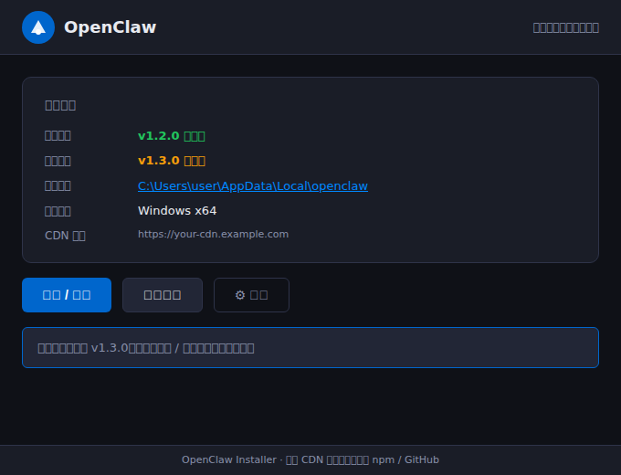
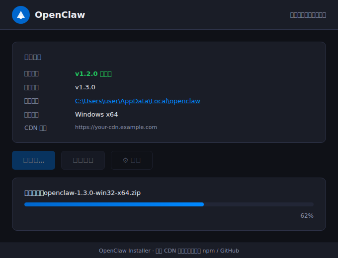
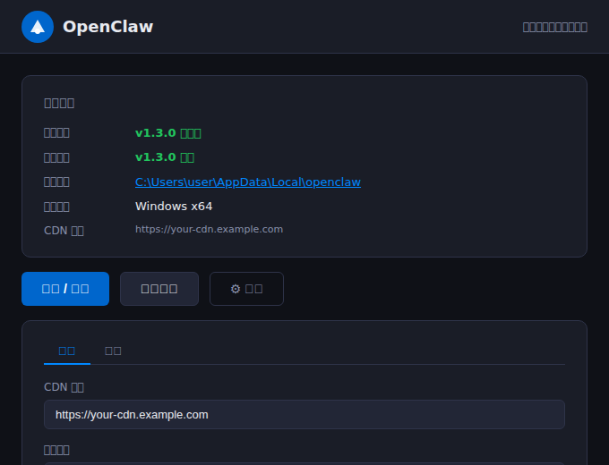
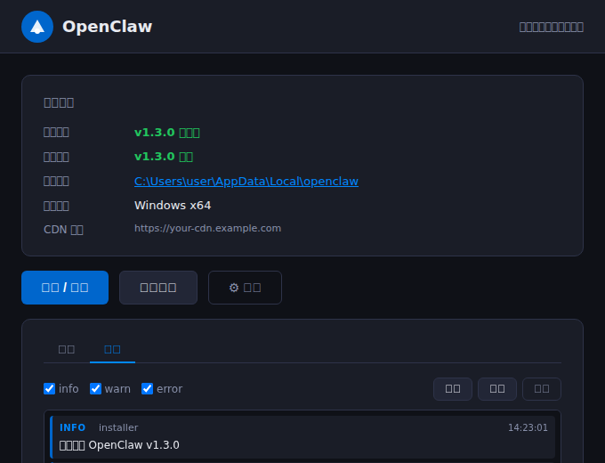
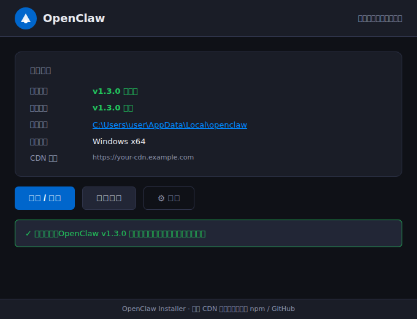

# GUI 使用说明 / GUI User Guide

本文档介绍如何使用 OpenClaw 图形化安装程序（GUI）完成 OpenClaw 的安装、升级和配置。

---

## 目录

1. [获取 GUI 安装程序](#1-获取-gui-安装程序)
2. [界面概览](#2-界面概览)
3. [首次安装](#3-首次安装)
4. [检查更新与升级](#4-检查更新与升级)
5. [下载进度](#5-下载进度)
6. [配置设置](#6-配置设置)
7. [查看日志](#7-查看日志)
8. [安装成功](#8-安装成功)
9. [常见问题](#9-常见问题)

---

## 1. 获取 GUI 安装程序

### 方式一：从 GitHub Releases 下载（推荐）

前往 [Releases 页面](https://github.com/chsword/openclaw-install-cn/releases/latest) 下载最新版本：

| 文件名 | 说明 |
|--------|------|
| `openclaw-gui-setup-*.exe` | Windows NSIS 安装包（推荐） |
| `openclaw-gui-portable-*.exe` | Windows 便携版（无需安装，双击即用） |

### 方式二：从源码运行（需 Node.js >= 18）

```bash
git clone https://github.com/chsword/openclaw-install-cn.git
cd openclaw-install-cn/gui
npm install
npm start
```

---

## 2. 界面概览

启动 GUI 后，主界面显示当前安装状态及操作按钮：



界面分为以下几个区域：

| 区域 | 说明 |
|------|------|
| **顶部标题栏** | 显示应用名称，可拖动移动窗口 |
| **安装状态卡片** | 显示当前版本、最新版本、安装目录、系统平台、CDN 地址 |
| **操作按钮区** | 「安装 / 升级」「检查更新」「⚙ 设置」三个按钮 |
| **消息区域** | 操作结果提示信息（操作后显示） |
| **底部状态栏** | 显示应用说明 |

### 状态卡片字段说明

| 字段 | 说明 |
|------|------|
| **当前版本** | 当前已安装的 OpenClaw 版本，未安装时显示「未安装」（黄色） |
| **最新版本** | CDN 上可用的最新版本，检查前显示「–」 |
| **安装目录** | OpenClaw 的安装路径，**点击可在文件管理器中打开** |
| **系统平台** | 当前操作系统及架构 |
| **CDN 地址** | 当前配置的 CDN 基础地址 |

---

## 3. 首次安装

**前提条件：** 需先在设置中配置正确的 CDN 地址（见 [第 6 节](#6-配置设置)）。

1. 确认「CDN 地址」已正确配置
2. 点击蓝色的「**安装 / 升级**」按钮
3. GUI 自动从 CDN 下载安装包并解压（见 [第 5 节 下载进度](#5-下载进度)）
4. 安装完成后显示绿色成功提示（见 [第 8 节](#8-安装成功)）

> **提示：** 首次安装前，当前版本字段会显示橙黄色的「未安装」。

---

## 4. 检查更新与升级

### 仅检查更新（不执行升级）

点击「**检查更新**」按钮，GUI 将：
- 连接 CDN 查询最新版本
- 在「最新版本」字段显示查询结果
- 若有新版本，显示提示消息



当检测到新版本时：
- 「当前版本」显示为绿色（已安装）
- 「最新版本」显示为黄色并标注「有更新」
- 底部消息区提示可升级

### 执行升级

检测到新版本后，点击「**安装 / 升级**」按钮即可开始升级。升级过程与安装完全相同，原有数据会自动备份，升级失败时自动回滚。

---

## 5. 下载进度

点击「安装 / 升级」后，界面显示实时下载进度：



下载过程中：
- 三个操作按钮变为半透明禁用状态，防止重复操作
- 显示当前正在下载的文件名
- 进度条实时更新（蓝色渐变）
- 右侧显示百分比数字

下载完成后自动开始解压和安装，整个过程无需人工干预。

---

## 6. 配置设置

点击「**⚙ 设置**」按钮展开设置面板：



### 可配置项

| 配置项 | 说明 | 示例 |
|--------|------|------|
| **CDN 地址** | 私有 CDN 的基础 URL | `https://your-cdn.example.com` |
| **安装目录** | OpenClaw 的安装路径（留空使用默认路径） | `C:\Users\user\AppData\Local\openclaw` |

### 默认安装目录

| 操作系统 | 默认路径 |
|---------|---------|
| Windows | `%LOCALAPPDATA%\openclaw` |
| macOS | `~/Library/Application Support/openclaw` |
| Linux | `~/.local/share/openclaw` |

### 操作步骤

1. 在「CDN 地址」输入框中填入 CDN 地址
2. （可选）在「安装目录」输入框中修改安装路径
3. 点击「**保存**」保存配置
4. 点击「**取消**」放弃修改并关闭设置面板

> **注意：** CDN 地址必须以 `https://` 或 `http://` 开头，且末尾不要加斜杠。

---

## 7. 查看日志

在设置面板中点击「**日志**」标签页，可查看安装过程的详细日志：



### 日志级别

| 级别 | 颜色 | 说明 |
|------|------|------|
| **INFO** | 蓝色 | 正常操作信息 |
| **WARN** | 黄色 | 警告（如网络重试）|
| **ERROR** | 红色 | 操作失败信息 |

### 日志工具栏

| 按钮 | 功能 |
|------|------|
| **刷新** | 重新加载日志文件内容 |
| **导出** | 将日志保存为文本文件 |
| **清空** | 清除当前显示的日志 |

日志级别筛选框（info / warn / error）可以单独勾选，只显示需要关注的日志级别。

---

## 8. 安装成功

安装或升级成功后，界面显示绿色成功提示：



成功后：
- 「当前版本」和「最新版本」均显示为绿色的最新版本号
- 底部消息区显示绿色成功提示
- 所有按钮恢复可用状态

---

## 9. 常见问题

### Q：点击「安装 / 升级」提示"无法连接 CDN"

**原因：** CDN 地址未配置或网络不通。

**解决方案：**
1. 点击「⚙ 设置」，检查「CDN 地址」是否正确填写
2. 确认当前网络环境能访问该 CDN 地址
3. 尝试在浏览器中打开 `{CDN地址}/manifest.json` 验证可达性

### Q：提示"版本未找到"

**原因：** CDN 上的 `manifest.json` 中没有当前平台对应的安装包。

**解决方案：**
1. 联系 CDN 运营者确认已上传对应平台的安装包
2. 参考 [CDN 搭建文档](deployment.md) 检查 manifest.json 格式

### Q：安装目录点击无反应

**原因：** 安装目录不存在（尚未安装）。

**解决方案：** 先执行安装操作，安装成功后再点击目录链接。

### Q：macOS / Linux 下如何运行 GUI？

从源码运行：
```bash
cd gui
npm install
npm start
```

或从 GitHub Releases 下载对应平台的安装包（macOS 为 `.dmg`，Linux 为 `.AppImage`）。

### Q：日志文件在哪里？

| 操作系统 | 日志路径 |
|---------|---------|
| Windows | `%USERPROFILE%\.oclaw\logs\` |
| macOS | `~/.oclaw/logs/` |
| Linux | `~/.oclaw/logs/` |

可通过日志面板中的「导出」按钮将日志保存到指定位置。

---

## 相关文档

- [部署指南](deployment.md) — CDN 搭建和版本发布流程
- [CLI 用法](../README.md#️-cli-用法) — 命令行工具使用说明
- [CDN 目录结构](../cdn-template/README.md) — CDN 模板说明
